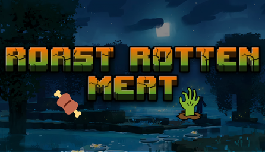
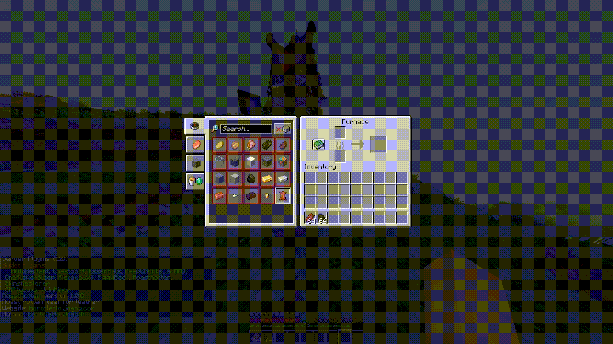

# 🍖 Roast Rotten Meat

<p align="center">This is a plugin created for Minecraft that consists of adding a new recipe that transforms rotten flesh into leather using a furnace. Developed for Bukkit version 1.21.</p>

<p align="center">
  
</p>

# 📓 Contents:

- About
    - [Features](#Features)
- Contents,
- How to use
    - [Prerequisites](#Prerequisites)
    - [Running the project](#Running-the-project)
- Tests,
- Technologies,
- Icons.

<br/>

# About:

### Features:

- [x] Create Custom Recipe
- [x] Create Messages
- [x] Create Join and Quit Message
- [x] Performed Tests

<br/>

# 📝 How to use:

<br/>

### Prerequisites:

You need to have the following tools installed on your machine: [Git](https://git-scm.com), [IntelliJ](https://www.jetbrains.com/) and [Minecraft Server](https://getbukkit.org/)

<br/>

### Running the project:

```bash
# Clone this repository
$ git clone <https://github.com/bortolettojoaog/roastrottenmeat.git>

# Access the project folder through terminal/cmd
$ cd roastrottenmeat

# Open the project in visual studio code
$ idea .

# Build de plugin using maven and add it to the server
```

<br/>

# ✔️ Tests:
<h1 align="center">
    
</h1>

<br/>

# 🛠️ Technologies:

The following tools were used in building the project:

- [Java](https://openjdk.org/)
- [Bukkit](https://getbukkit.org/)

<br/>

<br/>

---

<p align="center">
    Made with ❤️ by João Guilherme Bortoletto 👋
</p>

<p align="center">
    <a href="https://www.linkedin.com/in/bortolettojoaog/">See my LinkedIn</a>
</a>
